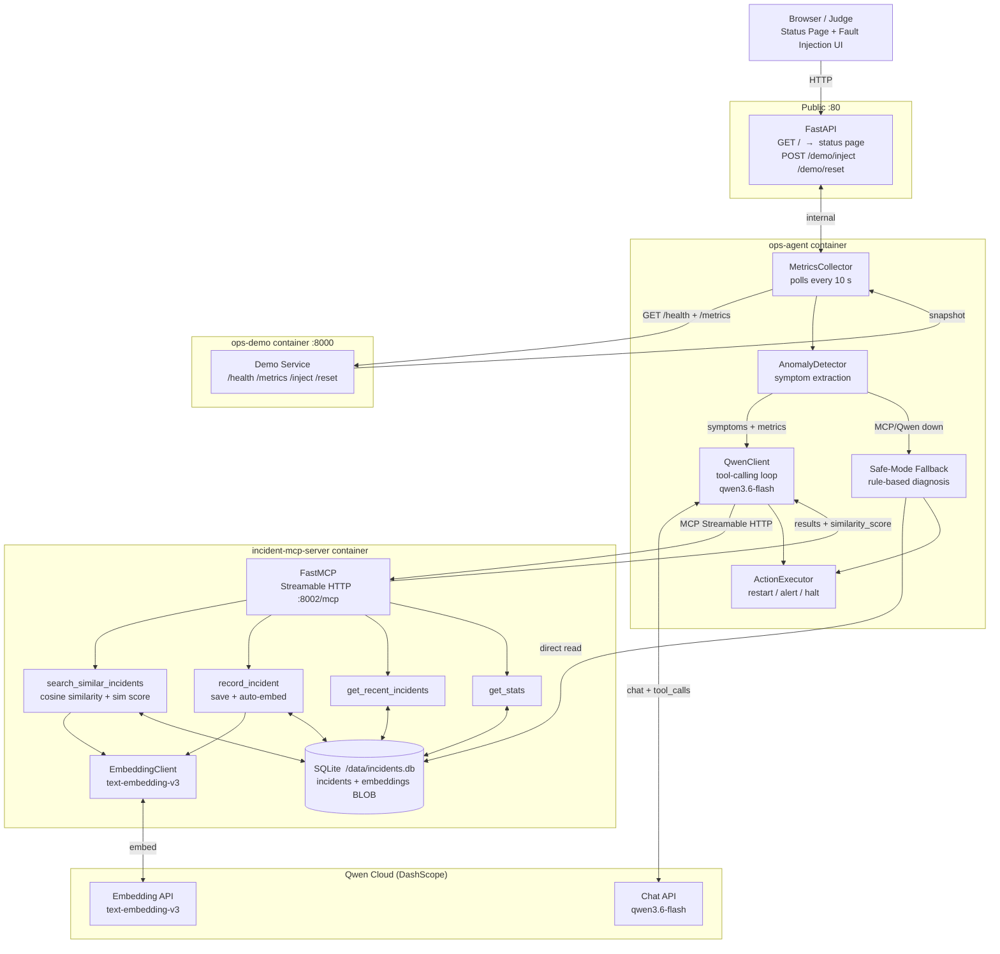

# Ops-Sentinel

**Autonomous on-call agent with persistent incident memory — Qwen Cloud Hackathon Track 1: MemoryAgent**

---

## The Problem

On-call engineers drown in repeated incidents. Every time a service overloads or a dependency goes down, someone has to diagnose it from scratch — even if the exact same fault happened last week. Runbooks go stale. Context is lost between shifts. Response time degrades under pressure.

**Ops-Sentinel remembers.** It watches a service continuously, detects anomalies, consults its own incident history via semantic search, calls Qwen to reason over past cases, and acts — all without human intervention. When the same fault recurs, the agent finds it in memory and responds with accumulated experience.

---

## Live Demo

**http://47.237.196.56/** — no login required.

Use the fault-injection buttons to trigger incidents and watch the agent respond in real time. The **MCP Tool Calls** table shows each tool invocation with `similarity_score`, proving semantic retrieval is active.

---

## Architecture



Full diagram with data-flow notes: [docs/architecture.md](docs/architecture.md)

---

## Key Features

| Feature | Detail |
|---------|--------|
| **Persistent incident memory** | Every incident is stored in SQLite with full metrics snapshot, diagnosis, action, and outcome |
| **Semantic search** | Incidents are embedded with `text-embedding-v3` (1024-dim); retrieval uses cosine similarity — finds conceptually similar faults even with different wording |
| **Similarity score in UI** | The status page shows `[semantic] id=X sim=0.89` in the MCP Tool Calls table — visible proof of semantic retrieval |
| **MCP tool-calling** | 4 tools exposed via FastMCP (Streamable HTTP): `search_similar_incidents`, `record_incident`, `get_recent_incidents`, `get_stats` |
| **Autonomous Qwen loop** | `qwen3.6-flash` drives the full diagnose → decide → act cycle via OpenAI-compatible tool-calling API |
| **Auto-embedding on write** | Every `record_incident` call computes and stores the embedding immediately — no migration needed |
| **Safe-mode degradation** | MCP down → direct SQLite text-overlap fallback; Qwen down → 3× retry → rule-based diagnosis. Agent never crashes. |
| **Fault injection UI** | One-click overload / memory-leak / dependency-down injection for live demonstration |

---

## Tech Stack

| Layer | Technology |
|-------|-----------|
| Agent runtime | Python 3.11, FastAPI, uvicorn, httpx |
| LLM | Qwen `qwen3.6-flash` via DashScope (OpenAI-compatible API) |
| Embeddings | Qwen `text-embedding-v3` — same API key, 1024-dim vectors |
| MCP layer | `mcp[cli]` (FastMCP), Streamable HTTP transport |
| Memory | SQLite — `incidents` + `incident_embeddings` (float32 BLOB), shared Docker volume |
| Demo target | FastAPI service with injectable faults |
| Infrastructure | Docker Compose (3 containers), Alibaba Cloud ECS |

---

## How It Works — Demo Flow

1. **Open** http://47.237.196.56/ — see the live status page
2. **Click "Reset Service"** to ensure the demo service starts clean
3. **Click "Inject: Overload"** — the demo service enters CPU-overload mode
4. **Wait ~10–20 s** — the agent detects high latency + symptoms, opens a Qwen tool-calling session
5. **Watch the MCP Tool Calls table** — Qwen calls `search_similar_incidents`, gets back `[semantic] id=X sim=0.87`, then calls `record_incident`
6. **See the incident** appear in the Recent Incidents table with diagnosis and action
7. **Inject the same fault again** — the agent finds the previous incident semantically, reasons from experience, and responds faster

Repeat with `memory_leak` and `dependency_down` to see different fault patterns retrieved from memory.

---

## Quick Start

```bash
git clone https://github.com/sany1810-dotcom/ops-sentinel.git
cd ops-sentinel
cp .env.example .env
# Edit .env and set QWEN_API_KEY
docker compose -f deploy/docker-compose.yml up -d
```

Status page: http://localhost  
Agent API:   http://localhost/api/status  
MCP calls:   http://localhost/api/mcp/calls

### Inject a fault

```bash
# Trigger overload
curl -X POST http://localhost/demo/inject \
  -H "Content-Type: application/json" -d '{"fault":"overload"}'

# Watch agent react (logs)
docker compose -f deploy/docker-compose.yml logs -f agent

# Reset
curl -X POST http://localhost/demo/reset
```

---

## Copilot Mode (Human-in-the-Loop)

By default the agent runs in **Pilot mode** — fully autonomous: detect → diagnose → act → record.

Set `AGENT_MODE=copilot` to require human approval before any action is executed.

```bash
# In .env or directly:
AGENT_MODE=copilot
docker compose -f deploy/docker-compose.yml up -d
```

In Copilot mode:
- When the agent diagnoses a fault it writes a **pending action** to SQLite instead of executing
- The status page shows a **PENDING APPROVALS** section with the proposed action, Qwen's reasoning, and similarity scores from semantic search
- Click **Approve** → action executes (restart / alert / halt) and incident is recorded in memory
- Click **Reject** → no action taken; incident recorded with `outcome=rejected_by_human`
- Duplicate anomaly cycles are deduplicated — one pending entry per active symptom set
- If MCP or Qwen is down, the pending action is still created using rule-based reasoning (safe-mode path)

Useful for production environments where automated restarts need a second pair of eyes.

## Repository Layout

```
agent/                   Agent loop, Qwen client, MCP client, SQLite memory, embedding client
incident_mcp_server/     FastMCP server — 4 MCP tools over Streamable HTTP
demo_service/            Fault-injectable target service
deploy/                  Dockerfiles, docker-compose.yml, ECS setup guide
docs/                    Architecture diagram
```

---

## Deployment

See [deploy/aliyun_setup.md](deploy/aliyun_setup.md) for step-by-step Alibaba Cloud ECS setup.
