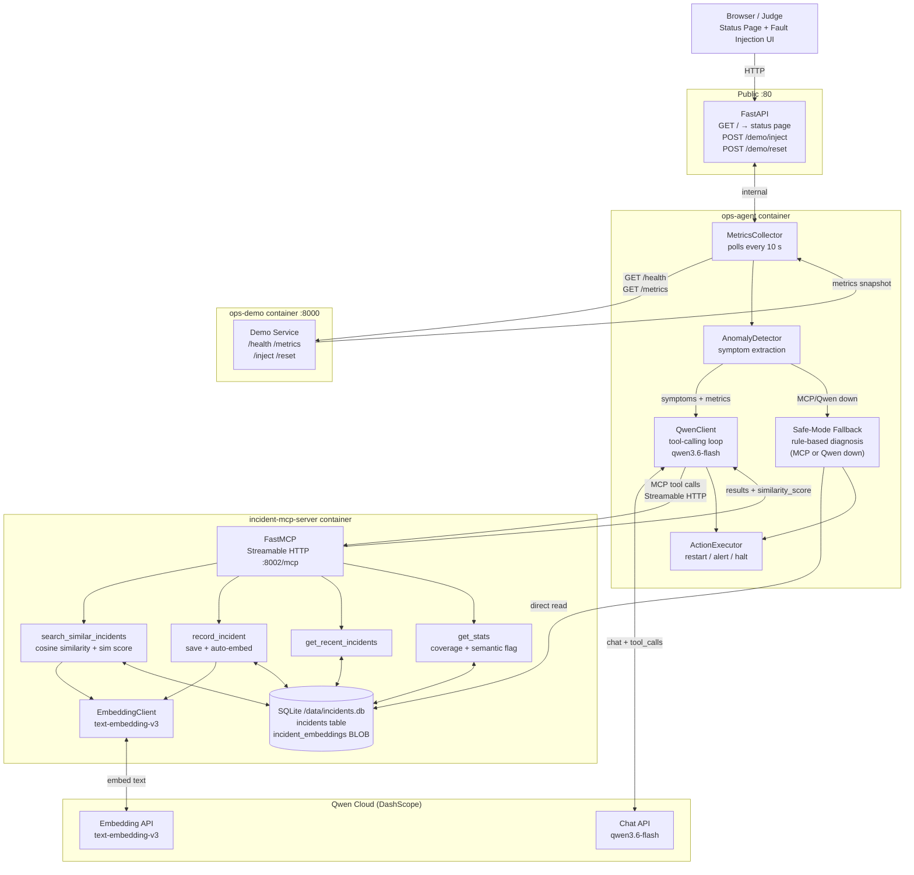

# Ops-Sentinel — Architecture

## Data flow — anomaly cycle

1. **Collect** — `MetricsCollector` calls `demo-service:8000/health` (latency) and `/metrics` (RSS, error rate, fault) every `AGENT_POLL_INTERVAL` seconds.
2. **Detect** — `AnomalyDetector` compares metrics against thresholds and emits a symptom list (`high_latency`, `high_rss`, `dependency_error`, …).
3. **Diagnose** — `QwenClient` opens a tool-calling session with `qwen3.6-flash`.  Qwen calls:
   - `search_similar_incidents` — MCP server embeds the query with `text-embedding-v3`, runs cosine similarity over stored vectors, returns top-N incidents with `similarity_score`.
   - `get_stats` — embedding coverage, semantic search flag.
   - `record_incident` — saves new incident and immediately computes + stores its embedding.
4. **Act** — agent executes the action (restart / alert / halt).
5. **Safe mode** — if MCP server or Qwen API is unreachable, agent falls back to rule-based diagnosis and direct SQLite text-overlap search, then retries MCP in the background.

## Storage

| Table | Contents |
|-------|----------|
| `incidents` | ts, symptoms (JSON), metrics_snapshot (JSON), diagnosis, action, outcome, resolved |
| `incident_embeddings` | incident_id (FK), model, embedding (float32 BLOB, 1024-dim), created_at |

Shared as a named Docker volume (`agent-data`) between `ops-agent` and `incident-mcp-server`.
